# DevFlow — Full Technical & Product Specifications Document

## 1. Product Overview & Core Capabilities
**DevFlow** is a modern, S-tier AI-powered website and application builder. It allows users to write prompts, generate complete multi-file React + Vite frontend applications, and instantly compile, execute, and preview them inside a sandboxed environment directly in the browser.

### What It Does
1. **Interactive Prompt-to-App Generation:** Generates comprehensive frontend applications from a simple natural language prompt, including file trees, styling config, mock data, and functional components.
2. **In-Browser Execution Sandbox:** Utilizes the **WebContainers API** to boot a virtualized Node.js WebAssembly kernel inside the browser, installing dependencies and running a Vite development server to display a live interactive preview of the generated project.
3. **Multi-File Context-Aware Refinement:** Understands previous iterations and applies granular updates to files without losing unrelated logic.
4. **Self-Healing Compilation Loop:** Validates the code's syntax on the server and utilizes a separate LLM self-healing pass to repair errors before code execution.
5. **Real-Time Workspace Sync:** Syncs the codebase and messaging thread in real time using the **Convex** backend-as-a-service database, allowing a seamless experience across multiple clients or browser reloads.
6. **Code Editor & Zip Export:** Employs an interactive CodeMirror editor for manual code adjustments (with auto-save and Ctrl+S hooks) and lets users export the entire workspace as a standard ZIP file.

### Target Audience & Use Cases
* **Prototyping & MVPs:** Startups and product managers seeking to turn ideas into clickable interfaces in seconds.
* **Developer Boilerplates:** Developers bootstraping React + Tailwind CSS environments with custom layout sections already organized.
* **Education & Design:** Designers wishing to import static assets or check visual responsiveness across devices.

---

## 2. Technology Stack & Third-Party Libraries
DevFlow is built on top of a highly responsive, modern stack:

### Frontend Layer
* **Core Framework:** Next.js 15.2.4 (App Router) + React 19.0.0 + TypeScript 5.
* **Styling & Layout:** Tailwind CSS v4.0.0 (loaded natively via CSS imports and processed for Vite projects).
* **Animations:** `motion` (v12.18.1, formerly Framer Motion) for smooth page reveals, spring-based transitions, and dashboard animations.
* **Component Primitives:** Radix UI (`@radix-ui/react-dialog`, `@radix-ui/react-tabs`, `@radix-ui/react-select`, `@radix-ui/react-scroll-area`) providing accessible foundations for modals, dropdowns, and layouts.
* **Code Editor:** `@uiw/react-codemirror` (v4.23.14) with CodeMirror language packs for JavaScript, TypeScript, CSS, HTML, JSON, and Markdown. It uses Visual Studio Dark and Sublime Text themes.
* **Visual Icons:** `lucide-react` (v0.513.0) for standard, clean icons.
* **Toasts & Feedback:** `sonner` (v2.0.7) for non-blocking success, info, and error notifications.
* **Top Loader:** `nextjs-toploader` (v3.9.17) for visual page loading indicators.

### Backend & Database Layer
* **Auth Platform:** `@clerk/nextjs` (v6.23.0) + `@clerk/themes` for user sign-in, user sign-up, and OAuth integration (GitHub & Google).
* **Database & BaaS:** `convex` (v1.24.8) for reactive document storage, serverless queries, real-time mutations, and connection sync.
* **Orchestration Client:** Axios and native `fetch` with AbortController mappings for network operations.
* **Zip Archiving:** `jszip` (v3.10.1) for packing client-side workspace files into a `.zip` archive.

### Core Developer & AI Stack
* **Wasm Microkernel:** `@webcontainer/api` (v1.6.1) for booting sandboxed Node.js environments inside the browser.
* **AI Clients:** `@google/genai` (v1.5.1) for Gemini models and custom client HTTP wrappers for OpenRouter integrations.
* **Code Validation:** `@babel/parser` (v7.29.7) to check syntax trees on generated Javascript/JSX code.
* **JSON Utility:** Custom state-machine cleaners to repair malformed JSON blocks.

---

## 3. High-Level System Architecture

DevFlow is designed around an event-driven, real-time sync model:

```mermaid
sequenceDiagram
    autonumber
    actor User as User Browser
    participant API as Next.js API Routes
    participant LLM as AI Models (Gemini/OpenRouter)
    participant DB as Convex Database
    participant WC as Browser WebContainer

    User->>DB: Send Prompt & Save Message
    User->>API: POST /api/plan (User Prompt)
    API->>LLM: Gemini 2.5 Flash (Planning Prompt)
    LLM-->>API: JSON Plan (Files, Dependencies, Design)
    API-->>User: Return Project Plan
    User->>DB: Update Workspace Info & Plan Metadata
    
    rect rgb(20, 20, 30)
        Note over User, API: Incremental Concurrency Phase (Files Generation)
        loop For Each File (Concurrency Limit: 2)
            User->>API: POST /api/generate-file (Plan + File Metadata)
            API->>LLM: OpenRouter Coding Pool (Laguna / Nemotron / Llama)
            LLM-->>API: Raw Source Code
            API->>API: Babel Parse check syntax
            alt Syntax Error Found
                API->>LLM: callGeminiRepair (Code + Error)
                LLM-->>API: Repaired Code
            end
            API-->>User: Return Source Code
            User->>DB: Save Incremental File to Workspace
        end
    end
    
    User->>WC: Mount Converted Folder Tree
    User->>WC: Run `pnpm install`
    WC-->>User: Installation Completed
    User->>WC: Run `npm run dev`
    WC-->>User: Event "server-ready" (url: localhost:5173)
    User->>User: Load iframe with Sandbox URL
```



---

## 4. AI Generation & Execution Pipelines

DevFlow features a robust multi-stage generation architecture divided into two main execution paths: **Initial Project Generation** and **Follow-up Incremental Generation**.

### A. Initial Project Generation Pipeline

#### 1. Blueprint Planning Phase (`/api/plan`)
When a user submits a brand new prompt (e.g., "Build a dashboard with a sidebar"), the client sends the request to the `/api/plan` route.
* **Model:** Google Gemini 2.5 Flash (via `callGeminiPlanner`).
* **Output:** A strict JSON plan defining:
  - `projectTitle`
  - `description`
  - `dependencies` (NPM packages needed beyond React/Vite)
  - `designSystem` (visual theme style, primary/accent/background hex colors, font family)
  - `sections` (display order of sections)
  - `files` (array of file paths to generate)
  - `buildOrder` (order of file generation: index.html -> package.json -> CSS -> components -> App.jsx -> main.jsx)
  - `recommendations` (exactly two prompt suggestions for next steps)
* **Post-processing:** The API route automatically validates that critical files (`vite.config.js`, `tailwind.config.js`, `postcss.config.js`) are included, appending them if they are missing.

#### 2. Concurrency-Controlled Generation Loop
Upon receiving the plan, the client sets the workspace state to `generating` and triggers the file generation loop.
* **Concurrency:** Managed by `runWithConcurrencyLimit(limit: 2)`. It builds up to two files in parallel to prevent browser blocking and optimize model queue distribution.
* **Code Generation (`/api/generate-file`):** 
  - Standard boilerplate files (`/index.html`, `/src/index.css`, `/src/main.jsx`, `/package.json`, etc.) are generated **instantly** and synchronously on the Next.js server using fast templates, bypassing LLM delays.
  - Custom component files are generated by passing the plan, current file list, and file index to the builder model.
* **Incremental Convex Saves:** As soon as each file successfully completes, the client makes an incremental mutation (`api.workspace.UpdateFiles`) to Convex. This prevents data loss in case of browser crashes or network timeouts.

---

### B. Follow-up Incremental Pipeline (`/api/follow-up-plan`)

When the user asks for changes to an existing project (e.g., "Add a search bar to the table"), DevFlow runs the follow-up planning flow:
1. **Change Mapping:** The request is sent to `/api/follow-up-plan` along with the list of existing files and the previous project plan.
2. **Minimal Edit Plan:** The model returns a JSON response containing `filesToChange` (an array of file paths that need regeneration or modification) and `changeReason`.
   - **Zero-Change Short Circuit:** If the planner determines no code changes are required, it returns an empty `filesToChange` array. The client updates status to `done` immediately.
3. **Execution Concurrency:** If changes are needed, the client sets `followUpFiles` state to isolate updates and runs the generation loop with **concurrency limit 3** to speed up iterative requests.
4. **Contextual Generation:** The `/api/generate-file` route receives a `changeContext` parameter containing the user prompt and change reason. The coding model is instructed to modify the file to satisfy the edit request while keeping unrelated code intact.
5. **Incremental Sync & Mount:** The updated code is saved to Convex and remounted onto the WebContainer.

---

### C. Concurrency & Queueing Mechanics
* Both pipelines utilize a custom queue runner to process files in parallel:
```typescript
async function runWithConcurrencyLimit<T, R>(
  limit: number,
  items: T[],
  fn: (item: T, index: number) => Promise<R>
): Promise<R[]> {
  const pool = new Set<Promise<void>>();
  const results: R[] = [];
  for (let i = 0; i < items.length; i++) {
    const item = items[i];
    const p = fn(item, i).then((r) => {
      results.push(r);
      pool.delete(p);
    });
    pool.add(p);
    if (pool.size >= limit) {
      await Promise.race(pool);
    }
  }
  await Promise.all(pool);
  return results;
}
```

---

### D. Self-Healing & Code Validation Pipeline
To ensure that generated code runs without breaking the WebContainer, a backend-guided validation and self-healing pipeline is executed:

```
[Generated Code] ──► Babel Parse Check ──► [Syntax Valid?]
                            │                   │
                            │ (No)              │ (Yes)
                            ▼                   ▼
                     Gemini Repair Loop    Save & Compile
                     (Max 2 Attempts)
```

1. **Syntax Parsing:** The generated code is checked using `@babel/parser` with `jsx` and `typescript` plugins enabled.
2. **Error Capture:** If the parsing fails, the error message (including file path, line numbers, and details) is captured.
3. **Model Self-Correction:** The server calls `callGeminiRepair` with the malformed code and the error trace. The model is instructed to return *only* the fixed code.
4. **Retry Threshold:** The repair loop runs up to 2 times. If it still fails, it returns the code with a `warning: "syntax_error"` flag, alerting the client side.

---

## 5. LLM Infrastructure, Fallbacks & API Management
To ensure maximum availability, cost optimization, and speed, DevFlow uses a multi-tier API rotation and fallback strategy.

### Model Tiers

| Pipeline | Primary Model | Fallback Models | API Gateway |
| :--- | :--- | :--- | :--- |
| **Planner & Repair** | **Gemini 2.5 Flash** | **Llama 3.3 70B**, **Qwen 3 Coder**, **Nemotron 3** | Google AI Studio / OpenRouter |
| **Builder (Code Gen)** | **Poolside Laguna-M.1** | **Nemotron 3 Super 120B**, **GPT-OSS 20B**, **Llama 3.3 70B**, **Qwen 3 Coder** | OpenRouter |

### Key Rotation & Rate-Limit (429) Handling
* **Key Rotation:** To prevent developer keys from exhausting their limits during multi-user sessions, the server loads an array of keys from the environment:
  - Gemini: `GEMINI_API_KEY_1`, `GEMINI_API_KEY_2`
  - OpenRouter: `OPENROUTER_API_KEY_1`, `OPENROUTER_API_KEY_2`
* **Incremental Fallback Routing:** If a primary model fails or returns a 429 status code, the client dynamically tags the failing model as blocked, shifts to the next available model in the queue, and retries the generation.
* **Winner Model Locking:** When a fallback model successfully compiles a file, it is locked as the `winnerModel` for that session. All subsequent files in the pipeline utilize that model, minimizing response discrepancies and maximizing build speed.

---

## 6. WebContainer Runtime Mechanics
The **WebContainers API** allows DevFlow to run a complete, sandboxed Node.js environment directly inside the browser's main thread using WebAssembly.

### Singleton Lifecycle Management
Since booting a WebContainer is resource-intensive, DevFlow implements a Singleton pattern (`WebContainerService`) to ensure only one microkernel container is booted per browser tab:
```typescript
class WebContainerService {
  private static instance: WebContainerService;
  private container: WebContainer | null = null;
  private isBooting = false;
  private bootPromise: Promise<WebContainer> | null = null;

  public static getInstance(): WebContainerService {
    if (!WebContainerService.instance) {
      WebContainerService.instance = new WebContainerService();
    }
    return WebContainerService.instance;
  }

  public async getContainer(): Promise<WebContainer> {
    if (this.container) return this.container;
    if (this.isBooting && this.bootPromise) return this.bootPromise;
    this.isBooting = true;
    this.bootPromise = WebContainer.boot();
    try {
      this.container = await this.bootPromise;
      this.isBooting = false;
      return this.container;
    } catch (error) {
      this.isBooting = false;
      this.bootPromise = null;
      throw error;
    }
  }
}
```

### Folder Tree Mapping
The client manages workspace files as a flat key-value record (e.g. `{ "/src/App.jsx": { code: "..." } }`). Before mounting, DevFlow dynamically reconstructs this flat layout into a nested directory object structure:
```typescript
export function convertToWebContainerFileSystem(fileStructure: InputFileStructure): FileSystemTree {
  const root: FileSystemTree = {};
  for (const fullPath in fileStructure) {
    const parts = fullPath.replace(/^\//, "").split("/");
    let current: FileSystemTree = root;
    for (let i = 0; i < parts.length; i++) {
      const part = parts[i];
      const isFile = i === parts.length - 1;
      if (isFile) {
        current[part] = { file: { contents: fileStructure[fullPath].code } };
      } else {
        if (!current[part]) {
          current[part] = { directory: {} };
        }
        current = (current[part] as { directory: FileSystemTree }).directory;
      }
    }
  }
  return root;
}
```

### Tailwind Performance Tuning
During file mounting, a custom regex pre-processor scans `tailwind.config` files and locks the `content` property to `content: ["./index.html", "./src/**/*.{js,ts,jsx,tsx}"]`. This prevents Tailwind CSS from traversing the massive `node_modules` directory in the virtual WASM file system, reducing build times from minutes to milliseconds and avoiding browser tab crashes.

### Sandbox Boot & Port Binding
1. **pnpm install:** Installs packages. Spawns `pnpm install` inside the container.
2. **npm run dev:** Boots dev server. Spawns `npm run dev` (Vite dev server).
3. **Port Listening:** Listens to the `server-ready` event:
   ```typescript
   webContainer.on("server-ready", (port, url) => {
     setUrl(url); // Set internal sandbox URL (e.g. https://...)
     setport(port.toString());
   });
   ```
4. **Iframe Rendering:** Binds the resulting WebContainer virtual preview URL directly to an iframe, loading the compiled React application.

---

## 7. Database Schema & Real-Time Synchronization (Convex)
Convex serves as the real-time database backend. It uses WebSockets to push document edits reactively to all active clients.

### Schema (`convex/schema.ts`)
```typescript
export default defineSchema({
  users: defineTable({
    name: v.string(),
    email: v.string(),
    image: v.string(),
    uid: v.string(), // Clerk UID
    conversationCount: v.optional(v.number()),
    lastConversationDate: v.optional(v.string()),
  }).index("uid", ["uid"]),
  
  workspaces: defineTable({
    info: v.optional(v.any()), // Plan metadata: title, description, status, recommendations
    messages: v.optional(v.array(v.object({
      role: v.optional(v.string()), // user / assistant
      type: v.optional(v.string()),
      id: v.optional(v.string()),
      content: v.string(),
      timestamp: v.optional(v.number())
    }))),
    files: v.optional(v.record(v.string(), v.object({ code: v.string() }))),
    user: v.id("users"), // Foreign Key reference to users
  }).index("by_user", ["user"]),
});
```

### Serverless Functions (`convex/workspace.ts`)
* `CreateWorkspace`: Creates a new session referencing a user.
* `GetWorkspace`: Reads workspace files, messages, and info.
* `UpdateMessages` / `UpdateFiles` / `Updateinfo`: Granularly patches active sessions.
* `getRecentWorkspacesByUser`: Fetches the last 3 active workspaces for the sidebar dashboard display.

### Daily Limit Logic (`canStartConversation`)
To prevent token abuse and control API costs, Convex implements a daily conversation usage limiter:
1. When a user requests code generation, the `canStartConversation` mutation is run.
2. It retrieves the user's `conversationCount` and `lastConversationDate`.
3. If the date does not match the current date (in `YYYY-MM-DD` format), the counter resets to `0`.
4. If the counter is greater than or equal to `4`, the mutation returns `{ allowed: false }`, blocking the prompt and triggering the `LimitDialog` component.
5. If allowed, it increments the count and updates the date.

### Client-Side Multi-Client Sync & Polling
If a user reloads the page or opens another window while code is generating, the client detects `info.status === "generating"`.
- It registers a `setInterval` (polling every 1.5 seconds) to fetch workspace messages and info updates.
- Once status changes to `done`, the polling halts, and files are downloaded into the WebContainer.

---

## 8. Styling & Design System Specification

DevFlow implements a cohesive **Zinc Monochrome / Grayscale** styling design tokens, offering high contrast and a premium feel.

### CSS Custom Properties (`globals.css`)
All layouts and typography are governed by semantic design tokens:

```css
:root {
  /* === DARK MODE === */
  --color-bg-page:         #09090b;   /* zinc-950 */
  --color-bg-surface:      #0f0f11;   /* Primary card backgrounds */
  --color-bg-elevated:     #18181b;   /* zinc-900 */
  --color-bg-hover:        #27272a;   /* zinc-800 */
  --color-bg-inset:        #000000;   /* OLED deep black */

  --color-border-subtle:   rgba(255, 255, 255, 0.04);
  --color-border-default:  rgba(255, 255, 255, 0.08);
  --color-border-strong:   rgba(255, 255, 255, 0.16);

  --color-text-primary:    #fafafa;   /* zinc-50 */
  --color-text-secondary:  #a1a1aa;   /* zinc-400 */
  --color-text-tertiary:   #71717a;   /* zinc-500 */

  --color-accent:          #ffffff;   /* Grayscale Accent */
  --color-accent-glow:     rgba(255, 255, 255, 0.08);
  --color-accent-light:    #e4e4e7;
  --color-accent-foreground: #09090b;
}

[data-theme="light"] {
  /* === LIGHT MODE === */
  --color-bg-page:         #ffffff;   /* Pure white */
  --color-bg-surface:      #fafafa;   /* zinc-50 */
  --color-bg-elevated:     #f4f4f5;   /* zinc-100 */
  --color-bg-hover:        #e4e4e7;   /* zinc-200 */

  --color-text-primary:    #09090b;   /* zinc-950 */
  --color-text-secondary:  #52525b;   /* zinc-600 */
  --color-text-tertiary:   #71717a;   /* zinc-500 */

  --color-accent:          #09090b;   /* Black Accent */
  --color-accent-foreground: #ffffff;
}
```

### Typography Stack
* **Heading Font:** `Onest` (Geometric grotesque). Used for all headers, navbar logo text, and section tags.
* **Body Font:** `Figtree`. Used for paragraph blocks, labels, chat messages, and form input elements.
* **Mono Font:** `JetBrains Mono`. Configured for all code previews, terminal consoles, and version indicators.

### Micro-Animations & Easing
DevFlow explicitly overrides default browser transitions in favor of custom-timed cubic-bezier mappings:
* `--ease-out`: `cubic-bezier(0.16, 1, 0.3, 1)` (Entering modals, drawers, and tabs).
* `--ease-spring`: `cubic-bezier(0.34, 1.56, 0.64, 1)` (Button clicks, hover expansions, scale effects).
* `--ease-soft`: `cubic-bezier(0, 0.55, 0.45, 1)` (Fading borders and text color transitions).

---

### Cinematic `HeroBeam` Canvas Component
A primary visual highlight of the landing page is the volumetric light beam positioned behind the dashboard mockup. It uses high-fidelity rendering calculations:
1. **Additive Blending:** Uses `ctx.globalCompositeOperation = 'screen'` to create a volumetric, silver-chrome beam glow effect.
2. **Bezier Trumpet-bell Curve:** Draws 8 layered path beams that curve outward based on a power-trumpet shape:
   $$w(y) = w_{top} + (w_{bottom} - w_{top}) \cdot \left(\frac{y + 300}{H}\right)^{4.5}$$
3. **Dynamic Alignment:** Employs a `ResizeObserver` tracking the dashboard mockup element. It calculates the offset (`landY`) and projects the beam floor bloom exactly onto the dashboard edge, maintaining alignment without layout shifts.
4. **Independent Shimmer Modulators:** Rotates multi-phase sinusoidal wave equations to breath the floor bloom, beam column, and floating particle system independently:
   - Beam Breathing: $0.88 + \sin(t \cdot 0.018) \cdot 0.12$
   - Bloom Pulse: $0.82 + \sin(t \cdot 0.026 + 1.9) \cdot 0.18$
   - Particle Shimmer: $0.90 + \sin(t \cdot 0.055) \cdot 0.10$

---

## 9. Comprehensive Directory Map & User Flows

### Directory Structure
```text
devflow/
├── app/
│   ├── (auth)/             # Clerk Auth Pages (sign-in, sign-up)
│   ├── (root)/             
│   │   ├── chat/
│   │   │   ├── [id]/       # Workspace Page (Workspace rendering & logic)
│   │   │   └── page.tsx    # Workspace List / Blank state dashboard
│   │   └── page.tsx        # Landing Page (includes Hero, Features, How it works)
│   ├── api/                
│   │   ├── follow-up-plan/ # POST: Plan delta changes
│   │   ├── generate-file/  # POST: Generate/edit a single file content
│   │   ├── models/status/  # GET: Check active status of OpenRouter endpoints
│   │   └── plan/           # POST: Generate full project JSON blueprint
│   ├── globals.css         # Zinc Monochrome variables & base styles
│   └── layout.tsx          # Clerk + Convex layout wrapper
├── components/
│   ├── custom/             # Workspace specific custom components (Sidebar, history)
│   │   └── webContainer/   
│   │       ├── preview.tsx # WebContainer runner (npm run dev control panel)
│   │       └── resizeable-editor.tsx # CodeMirror tabs & File Explorer panel
│   ├── home/               # Landing page marketing sections
│   ├── ui/                 # Reusable Shadcn UI component wrappers
│   └── HeroBeam.tsx        # HTML5 Canvas volumetric glow component
├── convex/                 
│   ├── schema.ts           # Convex DB Schema definitions
│   ├── users.ts            # User mutations & limit handlers
│   └── workspace.ts        # Session data mutations & sync queries
├── hooks/                  
│   ├── useAIChat.ts        # Core Orchestration hook (Model queues, concurrency, self-healing)
│   ├── useCodeEditor.ts    # File sync manager
│   └── useWebContainer.ts  # WebContainer mount and tailwind optimizer hook
└── lib/                    
    ├── gemini-client.ts    # Google AI client (calls planner & repairs code)
    ├── openrouter-client.ts# OpenRouter client with abort controls
    └── validator.ts        # Babel parsing syntax checker
```

---

### Step-by-Step User Flow
```
[User visits Landing Page]
           │
           ▼
[Enters Prompt & Clicks "Start Building"] ────► (Clerk Authentication Gate)
                                                       │
                                                       ▼
[Create Workspace in Convex] ◄──────────────── (User Authenticates)
           │
           ▼
[Redirect to /chat/[id]?message=...]
           │
           ▼
[State: useAIChat parses URL & Triggers OnGenerate]
           │
           ▼
[Call /api/plan] ──► [Generate Blueprint Plan] ──► [Convex Save Metadata]
                                                           │
                                                           ▼
[Loop Files: Concurrency 2] ──► [boilerplate instant templates]
                                └──► [call /api/generate-file]
                                             │
                                             ▼
                                     [Parse Code Syntax]
                                             │
                                  (Fail) ────┴────► (Pass)
                                    │                  │
                           [callGeminiRepair]          ▼
                                    │            [Convex Save File]
                                    ▼                  │
                             [Fixed Code] ─────────────┘
                                                       │
                                                       ▼
[Mount files to WebContainer] ◄───────────────── [All Files Generated]
           │
           ▼
[Trigger `pnpm install` inside Sandbox]
           │
           ▼
[Run `npm run dev` dev server]
           │
           ▼
[Extract local Wasm port URL]
           │
           ▼
[Frame loads sandbox app] ◄── [User interacts with App, edits code, downloads ZIP]
```

---

## 10. List of Raw System Prompts

Below are the exact, raw system prompts utilized by the pipelines to instruct the model layers.

### A. Planner Agent Prompt (`PLAN_SYSTEM_PROMPT`)
**Location:** [app/api/plan/route.ts](file:///c:/Users/porje/Coding/Projects/devflow/app/api/plan/route.ts#L24-L55)
```text
You are a technical planner for a React + Vite frontend code generator.
Analyze the user prompt and return ONLY a valid JSON object with no
markdown, no explanation, no code fences, no extra text.
Schema:
{
  "projectTitle": "string",
  "description": "string",
  "dependencies": { "package-name": "version" },
  "designSystem": {
    "style": "e.g. Modern SaaS, Minimal, Glassmorphism, Dark Premium",
    "colors": { "primary": "#hex", "accent": "#hex", "background": "#hex" },
    "fontFamily": "e.g. Inter, sans-serif"
  },
  "sections": ["Navbar", "Hero", "Features", "...more as needed"],
  "files": ["src/App.jsx", "src/components/Navbar.jsx", "src/components/Hero.jsx"],
  "buildOrder": ["index.html", "package.json", "src/index.css", "src/components/Navbar.jsx", "src/App.jsx", "src/main.jsx"],
  "recommendations": ["string", "string"]
}
Rules:
- Always include src/main.jsx, index.html, package.json, src/index.css in files.
- For any UI with multiple sections (landing pages, dashboards, multi-section apps),
  create separate component files under src/components/ for each section.
- App.jsx should ONLY import and compose components — never contain inline section code.
- Each component file should focus on one section (e.g. Hero.jsx, Features.jsx, Footer.jsx).
- buildOrder: index.html first, package.json second, CSS third, component files next,
  App.jsx after all components, src/main.jsx always last.
- The "sections" array lists UI sections in display order.
- The "designSystem" must define a cohesive visual theme matching the project type.
- Only include npm dependencies actually needed beyond React and Vite.
- Use React 18, Vite 5, Tailwind CSS 3.
- Do not include devDependencies in the dependencies field.
- In "recommendations", provide exactly 2 short prompt suggestions (max 60 chars) for next enhancements.
```

---

### B. Follow-Up Planner Agent Prompt (`FOLLOW_UP_SYSTEM_PROMPT`)
**Location:** [app/api/follow-up-plan/route.ts](file:///c:/Users/porje/Coding/Projects/devflow/app/api/follow-up-plan/route.ts#L9-L24)
```text
You are a code change planner for a React + Vite project.
Given an existing project's file list and a user request, determine the minimal set of files that need to be changed or created.
Return ONLY a valid JSON object with no markdown, no explanation, no code fences.
Schema:
{
  "filesToChange": ["src/components/Navbar.jsx"],
  "changeReason": "Brief description of what needs to change and why"
}
Rules:
- Only include files that genuinely need to be modified or regenerated.
- If a component's props or exports change, include its parent (e.g. App.jsx) only if it imports that component and the interface changed.
- If the request adds a new section, include the new file AND App.jsx.
- If the request mentions a specific error with a component name, include only that file.
- Never include boilerplate files: index.html, package.json, src/main.jsx, src/index.css, vite.config.js, tailwind.config.js, postcss.config.js.
- Minimum 1 file. Maximum the full component list only if a complete redesign is requested.
- Return an empty filesToChange array ONLY if no code changes are needed at all.
```

---

### C. Builder Agent Prompt (`BUILDER_SYSTEM_PROMPT`)
**Location:** [app/api/generate-file/route.ts](file:///c:/Users/porje/Coding/Projects/devflow/app/api/generate-file/route.ts#L9-L54)
```text
You are a React + Vite frontend code generator. Generate ONLY the raw
file content with no explanation, no markdown code fences, no triple
backticks, no commentary, no preamble.
Output only the exact file content that should be written to disk.
Rules:
- Use React 18 functional components with hooks only.
- Use Tailwind CSS 3 utility classes for all styling. No CSS-in-JS.
  No styled-components. No inline style objects unless absolutely required.
- All import paths must be relative (e.g. ./components/Hero).
- Do not use require(). Use ES module import/export only.
- Each component file must export a single default function component.
- Keep each file focused and under 120 lines when possible.
- Follow the project's design system exactly: use the specified colors,
  fonts, and visual style consistently across all components.
- Make designs visually impressive: use gradients, proper spacing,
  modern typography, hover effects, and responsive layouts.
- For package.json, always output valid JSON and merge plan dependencies
  into this exact base structure:
  {
    "name": "devflow-project",
    "private": true,
    "version": "0.0.0",
    "type": "module",
    "scripts": { "dev": "vite", "build": "vite build" },
    "dependencies": {
      "react": "^18.2.0",
      "react-dom": "^18.2.0"
    },
    "devDependencies": {
      "vite": "^5.0.0",
      "@vitejs/plugin-react": "^4.0.0",
      "tailwindcss": "^3.4.0",
      "autoprefixer": "^10.4.0",
      "postcss": "^8.4.0"
    }
  }
- For index.html always load the Tailwind CDN as a fallback:
  <script src="https://cdn.tailwindcss.com" crossorigin></script>
- For src/main.jsx always use:
  import React from 'react'
  import ReactDOM from 'react-dom/client'
  import './index.css'
  import App from './App'
  ReactDOM.createRoot(document.getElementById('root')).render(
    <React.StrictMode><App /></React.StrictMode>
  )
```

---

### D. Repair Agent Prompt (`callGeminiRepair`)
**Location:** [lib/gemini-client.ts](file:///c:/Users/porje/Coding/Projects/devflow/lib/gemini-client.ts#L36-L40)
```text
Fix all syntax errors in the following code. Return ONLY the corrected file content. No explanation, no markdown, no code fences.
Filename: ${filename}
Error: ${errorMessage}
Code to fix:
${code}
```
